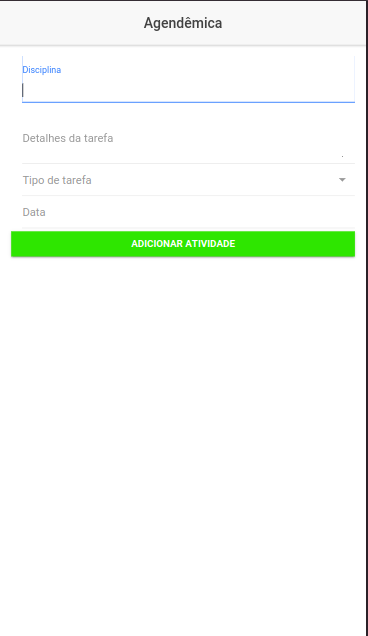

# 📅 Agendêmica: Seu Organizador Acadêmico

Bem-vindo ao **Agendêmica**! Este é um aplicativo de gerenciamento de tarefas acadêmicas projetado para estudantes que desejam manter suas atividades acadêmicas organizadas e em dia. Seja você um aluno que deseja organizar trabalhos, provas, apresentações ou eventos, o Agendêmica está aqui para ajudar! 📚

## 🌟 Funcionalidades Principais

- **Adição de Tarefas**: Adicione novas tarefas com facilidade. Basta inserir a disciplina, detalhes da tarefa, escolher o tipo de tarefa (trabalho, prova, apresentação ou evento) e definir a data da atividade.
- **Visualização de Tarefas**: As tarefas são exibidas em cartões organizados por categoria. Veja rapidamente o que precisa ser feito e quando.
- **Edição e Remoção de Tarefas**: Modifique os detalhes das tarefas ou remova-as quando não forem mais necessárias. Mantenha sua agenda sempre atualizada e organizada.
- **Filtro por Tipo de Tarefa**: Identifique visualmente o tipo de cada tarefa através de cores e estilos específicos para cada categoria.

## 📖 Como Usar

1. **Adicionar uma Tarefa**: Preencha os campos de disciplina, detalhes, selecione o tipo de tarefa e escolha a data. Depois, clique no botão "Adicionar Atividade" para criar um novo item.
2. **Editar uma Tarefa**: Clique no botão "Editar" em qualquer tarefa para fazer mudanças. Edite os detalhes e clique em "Salvar Alterações".
3. **Remover uma Tarefa**: Se você não precisa mais de uma tarefa, basta clicar no botão "Remover" para excluí-la da sua lista.

## 🎨 Design e Usabilidade

- Interface limpa e intuitiva, facilitando a navegação e o gerenciamento de tarefas.
- Uso de cores e ícones para facilitar a identificação rápida do tipo de tarefa.
- A estrutura do aplicativo foi pensada para ser prática e útil, maximizando a produtividade acadêmica.

## 🚀 Tecnologias Utilizadas

- **Ionic 3**: Framework híbrido para desenvolvimento de aplicativos móveis.
- **Angular**: Plataforma de desenvolvimento para criar aplicações web dinâmicas e responsivas.
- **HTML/CSS**: Marcação e estilização da interface do usuário para proporcionar uma experiência atraente e agradável.

## 🎥 Demonstração

Assista ao vídeo abaixo para ver o Agendêmica em ação e descobrir como usar o aplicativo:

[Vídeo de Demonstração do Agendêmica](https://youtu.be/gRPDJ2UcVmQ)

## Imagens

### Aqui estão algumas imagens do projeto:

  

## 📅 Contribua

Quer contribuir para o desenvolvimento do Agendêmica? Fique à vontade para abrir issues, enviar pull requests ou sugerir melhorias. Estamos abertos a novas ideias que possam tornar este aplicativo ainda mais útil para estudantes ao redor do mundo.

## 📬 Contato

Se você tiver alguma dúvida, sugestão ou feedback, não hesite em entrar em contato. Estamos aqui para ajudar e adoraríamos ouvir a sua opinião!

---

**Agendêmica** – Seu companheiro de organização acadêmica! 🎓📅📝
